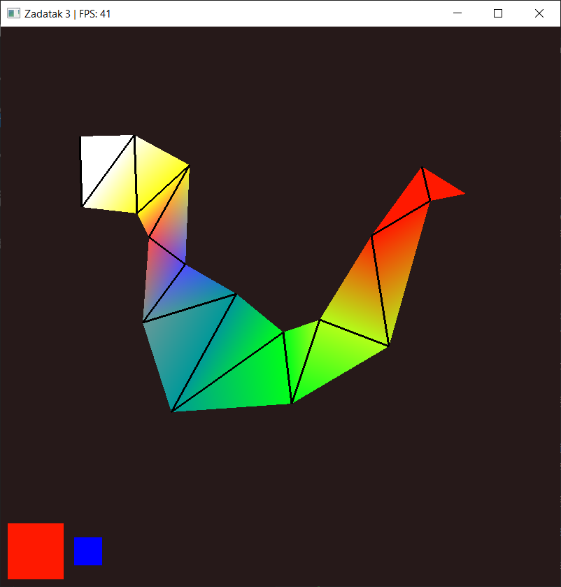
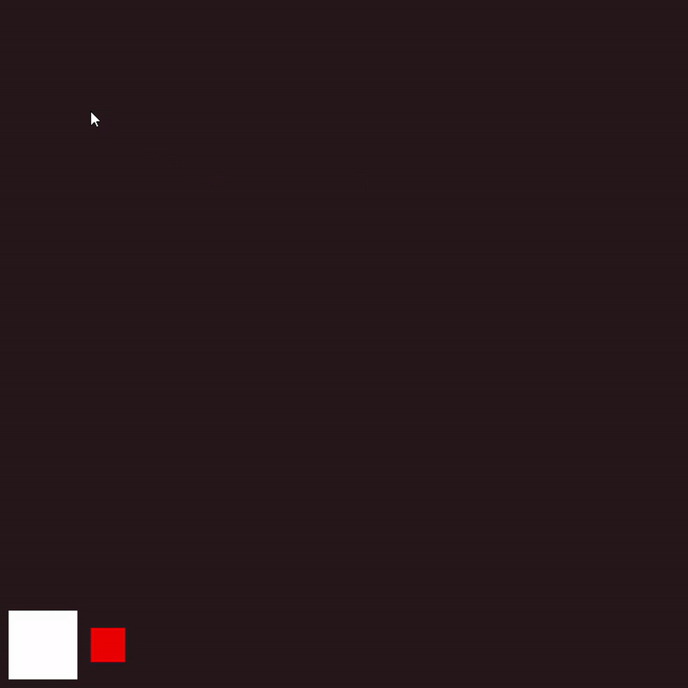
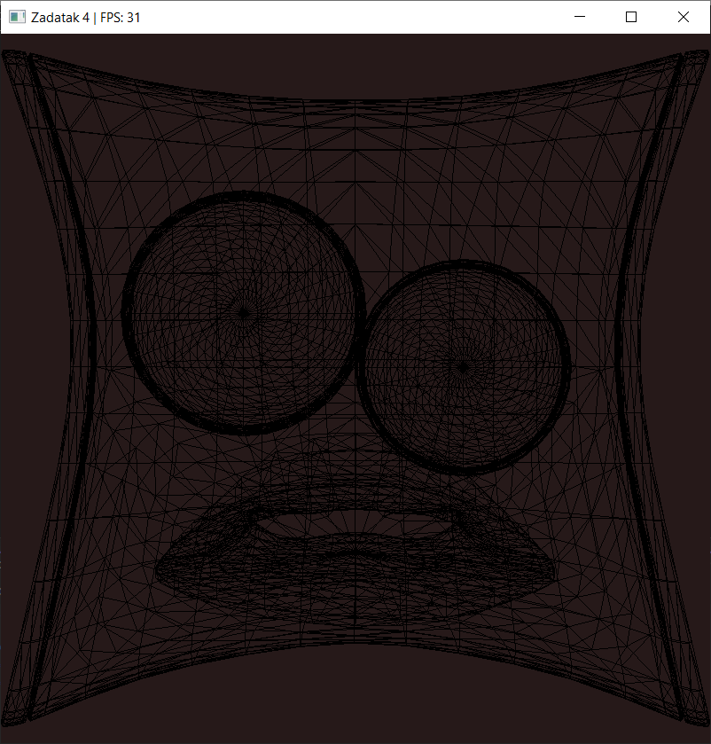
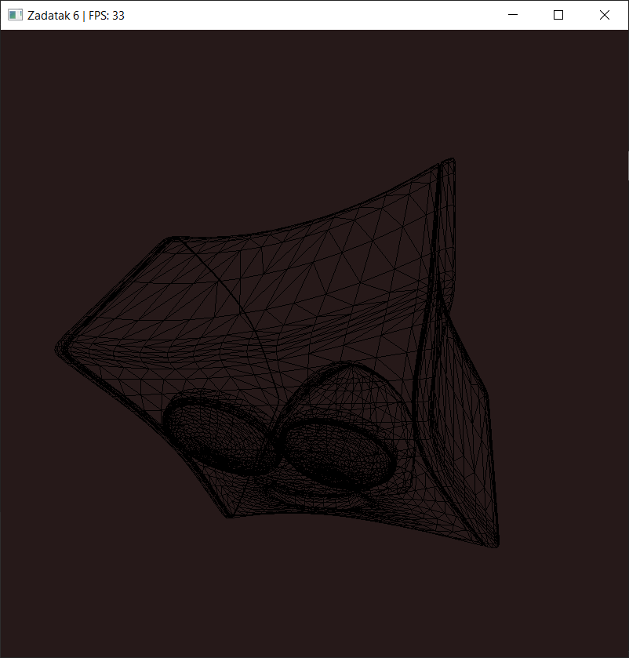
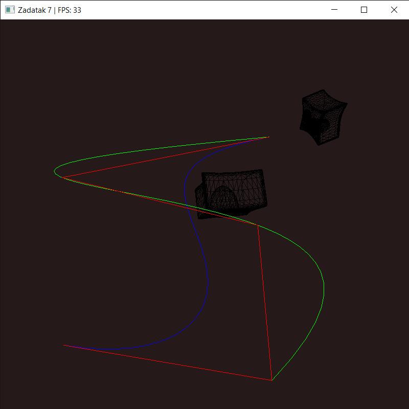
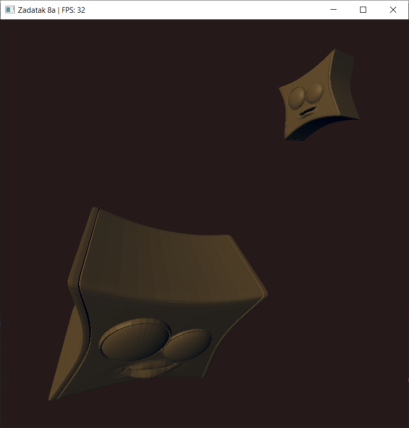

# 3d-renderer
Small 3D renderer made for the university course "Interactive Computer Graphics". Developed in C++ with OpenGL and focused on learning essential computer graphics algorithms and rendering techniques.

Made using code template on: https://gitlab.com/irgtim/irglab.

## Tech stack
- C++17
- OpenGL 3.x core profile
- GLFW
- GLAD
- CMake

## Setup
- Clone repository recursively: `git clone --recursive https://github.com/AntonioZulim/3d-renderer.git`
- Generate project in CMake (I generated .sln for Visual Studio)

## Showcase and instructions

### Assignment 1 (Vježba 1)
Bresenham's line algorithm example with toggleable restricted drawing frame

#### Controls:
- LEFT MOUSE BUTTON - add point 
- RIGHT MOUSE BUTTON - toggle drawing frame

### Assignment 2 (Vježba 2)
- Convex polygon filling example
- Testing whether a chosen point is inside the polygon (green - inside, red - outside)
- Bresenham's line algorithm used for drawing polygon borders
- Checking whether the chosen point maintains polygon convexity

#### Controls:
- LEFT MOUSE BUTTON - add polygon vertex
- RIGHT MOUSE BUTTON - end polygon creation, add test points

### Assignment 3 (Vježba 3)
Basic 2D rendering in OpenGL.

Draw triangle strip by adding points with chosen color. Larger left square shows chosen color, while smaller right square shows current manipulating color component

#### Controls:
- LEFT MOUSE BUTTON - add point
- R, G and B - choose color component to manipulate
- ARROW UP - increase choosen color component
- ARROW DOWN - decrease choosen color component

### Assignment 4 (Vježba 4)
- Loading and rendering 3D model in wireframe mode
- Normalize model (fit to screen size)

### Assignment 5a and 5b (Vježba 5a i 5b)
- Object positioning in the world (model matrix)
- Perspective camera view (view matrix, perspective matrix)
- FPS camera movement
- OOP code structure

Assignment 5a is using GLM, while in assignment 5b used matrices are calculated manually.

#### Controls:
- MOUSE POSITION - camera orientation
- SCROLL WHEEL - camera zoom
- W - go forward
- S - go backward
- A - go left
- D - go right
- Q - go up
- E - go down
- 1-9 - control object in scene
- 0 - control camera

### Assignment 6 (Vježba 6)
Backface culling algorithms that work on single convex model done in two ways. One is in scene space and the other one is in projection space.

#### Controls:
Same as in previous assignments.

### Assignment 7 (Vježba 7)
- Approximate Bezier curve (blue curve on the image)
- Interpolative cubic Bezier curve (green curve on the image, uses the 4 most recently added points)
- Bezier control polygon (red lines on the image)
- Camera animation along interpolative Bezier curve (camera looks in direction of curve tangent)

#### Controls:
- FPS camera movement like in previous assignments
- P - add point to Bezier control polygon
- SPACE - play animation

### Assignment 8 (Vježba 8)
Shading objects using Phong lighting model:

1. Assignment 8a uses constant shading

TODO:

2. Assignment 8b uses Gouraud shading

3. Assignment 8c uses Phong shading

#### Controls:
Same as in previous assignments.
